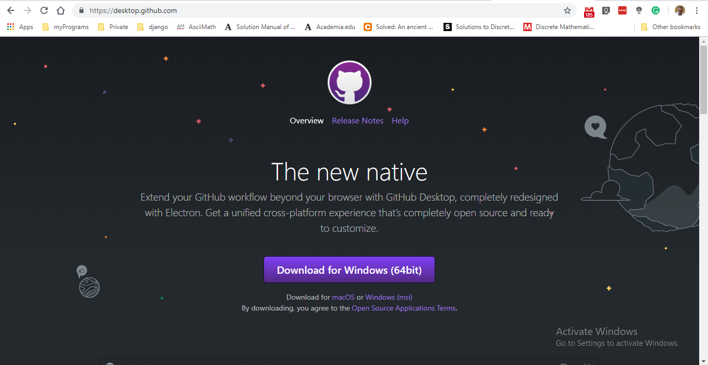
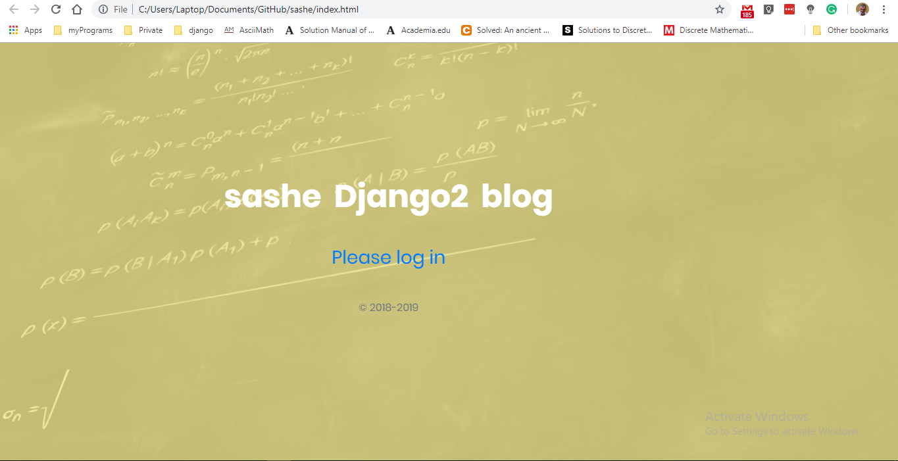
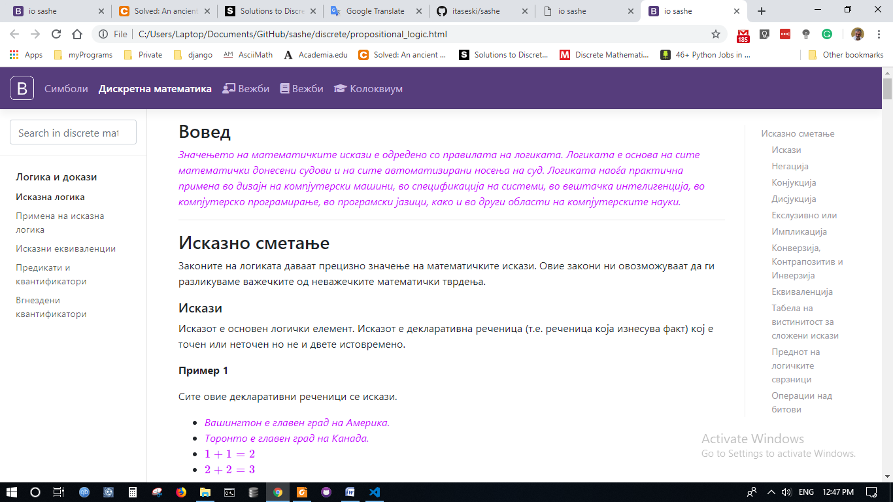
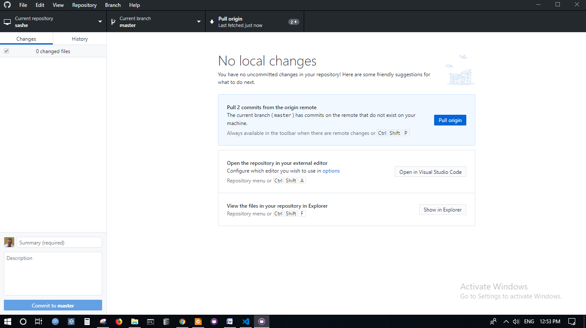

# For Саше eyes only

## Path to sashe repository

[click here for sashe repository on github.com /itaseski/sashe](https://github.com/itaseski/sashe)

- click button (green) Clone or Download

- on pull-down menu click Open in Desktop

- if nothing hapend you need to install GitHubDesktop App

- you can found installation page here

After installing GitHubDesktop go back to github.com/itaseski/sashe and clone repository by clicking green button, GitHubDesktop will create folder **sashe** on your computer in folder  **C:..\Documents\GitHub**.

**Note:It can vary on your compputer.**

Open local folder **sashe** on your computer and double click file index.html.

File index.html will be opened in your default browser.

Click link Please log in
New page will be opened.

Now click on Discrete Button

And you are on right place.
Know that site is best viewed on Chrome.

## Pull changes from github to local machine

Open GitHubDesktop APP
Click link **Fetch Origin** on top nav.

And after fetching click blue button Pull origin.

All changes will be saved to your local folder Github/sashe as you can see if you view files data modified property.

***That's all, for now***

Ask yourself - how this file is created, and what file extension .md means?

