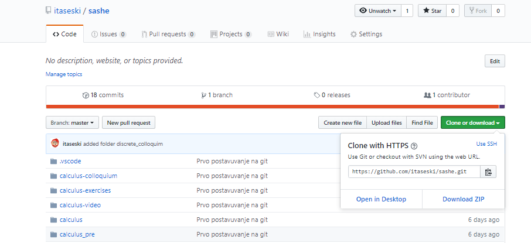

# Упатство за Саше

## Open in Desktop

- https://github.com/itaseski/sashe
- click button (green) Clone or Download
- on pull-down menu click Open in Desctop

If you have installed github Desktop, folder sashe will be greated in C:..\Documents\GitHub

Open folder C:...Documents\GitHub\sashe and double-click index.html 

**That's all.**

